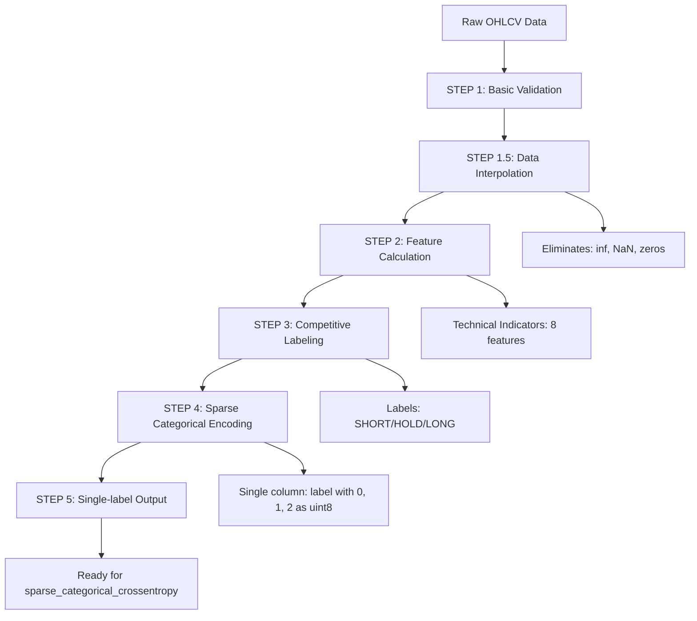

# 📋 DOKUMENTACJA MODUŁU VALIDATION_AND_LABELING

## 🎯 PRZEGLĄD MODUŁU

Moduł `validation_and_labeling` to kompletny system walidacji, interpolacji i etykietowania danych historycznych dla modelowania machine learning w tradingu. Moduł implementuje zaawansowane algorytmy naprawy danych oraz competitive labeling dla przygotowania training-ready datasets.

**Lokalizacja:** `C:\Users\macie\OneDrive\Python\Binance\Freqtrade\validation_and_labeling`

---

## 🗂️ STRUKTURA MODUŁU

```
validation_and_labeling/
├── 📁 input/                          # Surowe dane wejściowe
│   ├── BTCUSDT_1m_raw.csv            # Raw data w formacie CSV (167MB)
│   └── BTCUSDT_1m_raw.feather        # Raw data w formacie Feather (82MB)
├── 📁 output/                         # Przetworzone dane wyjściowe
│   ├── 📁 reports/                    # Raporty z przetwarzania
│   └── BTCUSDT_TF-1m__FW-120__SL-050__TP-100__training_ready.feather (194MB)
├── 📁 archives/                       # Archiwalne wersje modułów
│   ├── preprocess_data.py            # Poprzednia wersja preprocessing
│   └── data_quality_validator.py     # Poprzedni system walidacji
├── 📁 __pycache__/                    # Python cache
├── 📄 main.py                        # Główny pipeline orchestrator
├── 📄 data_validator.py              # System walidacji danych
├── 📄 data_interpolator.py           # Algorytm interpolacji danych
├── 📄 competitive_labeler.py         # System competitive labeling
├── 📄 feature_calculator.py          # Obliczanie wskaźników technicznych
├── 📄 binance_data_downloader.py     # Pobieranie danych z Binance
├── 📄 utils.py                       # Funkcje pomocnicze
├── 📄 config.py                      # Konfiguracja modułu
├── 📄 demo.py                        # Demo pełnego pipeline
├── 📄 demo_download.py               # Demo pobierania danych
├── 📄 __init__.py                    # Inicjalizacja modułu
├── 📄 requirements.txt               # Zależności Python
├── 📄 README.md                      # Dokumentacja użytkownika
└── 📄 README_DOWNLOADER.md           # Dokumentacja downloadera
```

---

## 🔧 SZCZEGÓŁOWY OPIS PLIKÓW

### 📄 **main.py** *(18KB, 415 linii)*
**Rola:** Główny orchestrator całego pipeline'u validation_and_labeling

**Kluczowe klasy:**
- `ValidationAndLabelingPipeline` - główna klasa zarządzająca
- `NumpyEncoder` - encoder dla serializacji JSON numpy types

**Funkcjonalności:**
- Orkiestracja całego procesu walidacji i etykietowania
- Równoległe przetwarzanie wielu par walutowych
- Zaawansowany system raportowania i logowania
- Obsługa JSON serialization dla numpy types (int64, float64, bool)
- Generowanie training-ready output files
- Performance monitoring i memory tracking

**Pipeline Steps:**
1. **STEP 1:** Ładowanie i podstawowa walidacja danych
2. **STEP 1.5:** Interpolacja danych (eliminacja inf/NaN/zeros)
3. **STEP 2:** Obliczanie wskaźników technicznych (features)
4. **STEP 3:** Competitive labeling (SHORT/HOLD/LONG)
5. **STEP 4:** Konwersja do sparse categorical format (uint8)
6. **STEP 5:** Zapis single-label training-ready format

**Kluczowe metody:**
- `process_pair()` - przetwarzanie pojedynczej pary
- `_save_pair_report()` - zapis raportu JSON z NumpyEncoder
- `_log_progress()` - monitoring postępu z memory usage

---

### 📄 **data_interpolator.py** *(21KB, 479 linii)*
**Rola:** Implementacja zaawansowanego algorytmu interpolacji danych

**Algorytm interpolacji bazuje na ustaleniach z memory-bank/notes/walidacja_danych.md:**

#### **🔍 Kryteria prawidłowej świecy:**
- Volume > 0
- Wszystkie ceny (OHLC) > 0  
- Logika OHLC: `High >= max(Open, Close)` i `Low <= min(Open, Close)`
- Brak wartości inf, -inf, NaN

#### **🛠️ Strategie naprawy:**
1. **Pojedyncza zepsuta świeca:** Średnia arytmetyczna z sąsiadów
2. **Blok zepsutych świec:** Interpolacja liniowa między najbliższymi prawidłowymi
3. **Dodanie szumu:** ±1% do ±5% dla realizmu danych
4. **Iteracyjna naprawa:** Maksimum 3 iteracje
5. **Zabezpieczenia wydajnościowe:** Timeout 5min, max 50% corrupted data

**Kluczowe klasy:**
- `DataInterpolator` - główna klasa algorytmu

**Kluczowe metody:**
- `interpolate_data()` - główna metoda interpolacji
- `_identify_corrupted_candles()` - identyfikacja problemowych świec
- `_group_corrupted_into_blocks()` - grupowanie sąsiadujących problemów
- `_fix_corrupted_block()` - naprawa bloku świec
- `_interpolate_single_candle()` - naprawa pojedynczej świecy
- `_add_realistic_noise()` - dodanie szumu dla realizmu
- `_fix_ohlc_logic()` - korekta logiki OHLC

**Zabezpieczenia wydajnościowe:**
- Progress reporting co 5% postępu
- Timeout protection (5 minut)
- Limit corrupted data (max 50%)
- Memory usage monitoring

---

### 📄 **data_validator.py** *(21KB, 492 linie)*
**Rola:** Kompleksowa walidacja jakości danych

**Funkcjonalności:**
- Walidacja podstawowych pól OHLC, volume, timestamp
- Wykrywanie duplikatów i missing values
- Walidacja logiki OHLC
- Data type validation i sanitization
- Chronological order validation
- Outlier detection dla cen i wolumenu

**Kluczowe klasy:**
- `DataValidator` - główna klasa walidacji

**Kluczowe metody:**
- `validate()` - główna metoda walidacji
- `_validate_basic_fields()` - walidacja podstawowych pól
- `_validate_ohlc_logic()` - sprawdzanie logiki OHLC
- `_validate_chronological_order()` - walidacja chronologii
- `_sanitize_data_types()` - czyszczenie typów danych
- `_handle_missing_values()` - obsługa braków danych

**Sanitization backup (fallback po interpolacji):**
- Zastąpienie inf/-inf wartością 1.0
- Forward fill dla pozostałych NaN
- Konwersja do odpowiednich typów danych

---

### 📄 **competitive_labeler.py** *(22KB, 488 linii)*
**Rola:** Zaawansowany system etykietowania competitive trading

**Algorytm Competitive Labeling:**
1. **Forward Window:** Analiza przyszłych cen (domyślnie 120 minut)
2. **Stop Loss:** Próg straty (domyślnie 5.0%)
3. **Take Profit:** Próg zysku (domyślnie 10.0%)
4. **Triple Barrier Method:** Pierwsze trafienie: SL, TP, lub czas

**Strategia etykietowania:**
- **SHORT (0):** Gdy SL zostanie trafiony przed TP
- **HOLD (1):** Gdy żaden próg nie zostanie trafiony w oknie czasowym  
- **LONG (2):** Gdy TP zostanie trafiony przed SL

**Format output (AKTUALIZOWANY 2025-01-27):**
- **Pojedyncza kolumna 'label'** z wartościami 0, 1, 2 (uint8)
- **Oszczędność pamięci:** 4x mniej niż poprzedni one-hot format
- **Mapowanie klas:** 0=SHORT, 1=HOLD, 2=LONG

**Kluczowe klasy:**
- `CompetitiveLabeler` - główna klasa etykietowania

**Kluczowe metody:**
- `generate_labels_with_ohlc()` - główna metoda tworzenia labeli z dostępem do OHLC
- `_execute_competitive_labeling_algorithm()` - implementacja algorytmu competitive labeling
- `_format_labels_for_training()` - formatowanie etykiet zgodnie z konfiguracją
- `_prepare_optimized_data_access()` - optymalizacja dostępu do danych (O(1) lookup)

**Performance optimizations:**
- Vectorized operations na numpy arrays
- Progress reporting co 5000 rows
- Memory efficient processing
- Batch processing dla dużych datasets

---

### 📄 **feature_calculator.py** *(17KB, 379 linii)*
**Rola:** Obliczanie wskaźników technicznych (features dla ML)**

**Implementowane wskaźniki:**
- **Moving Averages:** SMA, EMA (różne okresy)
- **RSI:** Relative Strength Index
- **MACD:** Moving Average Convergence Divergence
- **Bollinger Bands:** Upper, Lower, %B
- **Volume indicators:** Volume MA, Volume change %
- **Price ratios:** Price/MA ratios
- **Volatility measures:** Price change %, High-Low spreads

**Kluczowe klasy:**
- `FeatureCalculator` - główna klasa obliczeń

**Kluczowe metody:**
- `add_all_features()` - dodanie wszystkich wskaźników
- `_add_moving_averages()` - średnie kroczące
- `_add_rsi()` - RSI calculation
- `_add_macd()` - MACD calculation
- `_add_bollinger_bands()` - Bollinger Bands
- `_add_volume_features()` - wskaźniki wolumenu
- `_add_price_ratios()` - relacje cenowe

**Problem rozwiązany przez interpolację:**
- **Krytyczny bug linia 194-200:** volume_change calculation bez zabezpieczenia przed dzieleniem przez zero
- Po implementacji interpolacji problem został wyeliminowany u źródła

---

### 📄 **binance_data_downloader.py** *(17KB, 447 linii)*
**Rola:** Pobieranie danych historycznych z Binance API

**Funkcjonalności:**
- Pobieranie OHLCV data z Binance Spot API
- Obsługa rate limitów i retry logic
- Chunked downloading dla dużych okresów
- Automatyczne mergowanie chunks
- Data validation po pobraniu
- Export do CSV i Feather formats

**Kluczowe klasy:**
- `BinanceDataDownloader` - główna klasa downloadera

**Kluczowe metody:**
- `download_data()` - główna metoda pobierania
- `_download_chunk()` - pobieranie pojedynczego chunka
- `_merge_chunks()` - łączenie pobranych części
- `_validate_downloaded_data()` - walidacja pobranych danych
- `_handle_rate_limit()` - obsługa limitów API

**Zabezpieczenia:**
- Rate limiting (max 1200 requests/minute)
- Retry mechanism z exponential backoff
- Data integrity validation
- Progress reporting

---

### 📄 **utils.py** *(9.5KB, 306 linii)*
**Rola:** Funkcje pomocnicze używane w całym module

**Kluczowe funkcje:**
- `setup_logger()` - konfiguracja systemu logowania
- `get_memory_usage()` - monitoring zużycia pamięci
- `validate_file_path()` - walidacja ścieżek plików
- `calculate_processing_speed()` - obliczanie wydajności
- `format_time_duration()` - formatowanie czasu
- `safe_divide()` - bezpieczne dzielenie (eliminuje dzielenie przez zero)

**Utility classes:**
- `ProgressTracker` - tracking postępu operacji
- `MemoryMonitor` - monitoring pamięci
- `FileHandler` - obsługa plików

---

### 📄 **config.py** *(8.6KB, 216 linii)*
**Rola:** Centralna konfiguracja całego modułu

**Kluczowe konfiguracje:**

#### **Training Compatibility Configuration (AKTUALIZOWANE 2025-01-27):**
```python
TRAINING_COMPATIBILITY_MODE = True              # Włącz training-ready output
LABEL_OUTPUT_FORMAT = "sparse_categorical"      # Format etykiet (zmienione z "onehot")
LABEL_DTYPE = "uint8"                          # Typ danych (zmienione z "float32")
INCLUDE_TRAINING_METADATA = True               # Dodaj metadata dla training module
```

#### **Competitive Labeling Settings:**
```python
LONG_TP_PCT = 1.0          # Take Profit dla pozycji LONG (%)
LONG_SL_PCT = 0.5          # Stop Loss dla pozycji LONG (%)
SHORT_TP_PCT = 1.0         # Take Profit dla pozycji SHORT (%)
SHORT_SL_PCT = 0.5         # Stop Loss dla pozycji SHORT (%)
FUTURE_WINDOW = 120        # Okno prognozy (minuty)
```

#### **Interpolation Settings (dodane po implementacji):**
```python
INTERPOLATION_ENABLED = True    # Włączenie/wyłączenie interpolacji
MAX_ITERATIONS = 3             # Maksymalna liczba iteracji naprawy
NOISE_PERCENTAGE = 2.0         # Procent szumu dla realizmu (%)
MAX_CORRUPTED_PERCENTAGE = 50  # Maksymalny procent uszkodzonych danych
INTERPOLATION_TIMEOUT = 300    # Timeout interpolacji (sekundy)
```

#### **Moving Averages Settings:**
```python
MA_SHORT_WINDOW = 1440      # Krótka MA (1 dzień w minutach)
MA_LONG_WINDOW = 43200      # Długa MA (1 miesiąc w minutach)
```

#### **Label Format Specifications:**
```python
SUPPORTED_LABEL_FORMATS = {
    "int8": "Compact format: [0, 1, 2] as int8",
    "onehot": "One-hot encoding: [[1,0,0], [0,1,0], [0,0,1]] as float32", 
    "sparse_categorical": "Sparse format: [0, 1, 2] as uint8"  # AKTUALNY
}
```

#### **Data Processing Settings:**
```python
BATCH_SIZE = 5000              # Rozmiar batcha dla processing
MEMORY_LIMIT_GB = 4            # Limit pamięci (GB)
PROGRESS_REPORT_INTERVAL = 5000 # Częstotliwość raportów postępu
```

---

### 📄 **demo.py** *(12KB, 340 linii)*
**Rola:** Demonstration pełnego pipeline'u z przykładowymi danymi

**Funkcjonalności:**
- Demo kompletnego procesu validation_and_labeling
- Przykłady konfiguracji dla różnych scenariuszy
- Performance benchmarking
- Interactive examples

---

### 📄 **demo_download.py** *(1.8KB, 61 linii)*
**Rola:** Demo pobierania danych z Binance

**Funkcjonalności:**
- Przykład użycia BinanceDataDownloader
- Konfiguracja pobierania dla różnych par i timeframes
- Basic usage examples

---

### 📄 **README.md** *(8.1KB, 248 linii)*
**Rola:** Dokumentacja użytkownika modułu

**Zawartość:**
- Quick start guide
- Installation instructions
- Usage examples
- API documentation
- Troubleshooting guide

---

### 📄 **README_DOWNLOADER.md** *(4.6KB, 163 linie)*
**Rola:** Specjalizowana dokumentacja dla data downloadera

**Zawartość:**
- Binance API setup
- Rate limiting guidelines
- Data format specifications
- Error handling examples

---

### 📄 **requirements.txt** *(79B, 5 linii)*
**Rola:** Python dependencies dla modułu

**Kluczowe zależności:**
```
pandas
numpy
requests
python-binance
pyarrow
```

---

### 📄 **__init__.py** *(1.2KB, 41 linii)*
**Rola:** Inicjalizacja modułu i eksport głównych klas

**Eksportowane klasy:**
- `ValidationAndLabelingPipeline`
- `DataValidator`
- `DataInterpolator` 
- `CompetitiveLabeler`
- `FeatureCalculator`
- `BinanceDataDownloader`

---

## 🏗️ ARCHIWUM (archives/)

### 📄 **preprocess_data.py** *(29KB, 735 linii)*
**Rola:** Poprzednia wersja systemu preprocessing (przestarzała)

### 📄 **data_quality_validator.py** *(59KB, 1436 linii)*
**Rola:** Poprzedni system walidacji danych (zastąpiony przez data_validator.py i data_interpolator.py)

---

## 🎯 ALGORYTMY I USTALENIA

### ✅ **USTALENIE 1: ALGORYTM INTERPOLACJI DANYCH**
**Data:** 2025-01-27
**Status:** ✅ ZAIMPLEMENTOWANY w `data_interpolator.py`

**Kluczowe cechy algorytmu:**
- **Pojedyncza zepsuta świeca:** średnia arytmetyczna z sąsiadów
- **Wiele zepsutych świec:** interpolacja liniowa między najbliższymi prawidłowymi
- **Zepsute dane sąsiednie:** skanowanie w poszukiwaniu prawidłowych świec
- **Dodanie szumu:** dla realizmu (±1% do ±5%)
- **Iteracyjna naprawa:** maksimum 3 iteracje
- **Kryteria prawidłowej świecy:** volume > 0, ceny > 0, logika OHLC, brak inf/NaN

### ✅ **USTALENIE 2: OBSŁUGA DZIELENIA PRZEZ ZERO**
**Data:** 2025-01-27
**Status:** ✅ ROZWIĄZANE przez interpolację

**Decyzje:**
- **Volume = 0:** Interpolacja liniowa eliminuje problem u źródła
- **Price = 0:** Interpolacja liniowa eliminuje problem u źródła
- **Volume_change calculation:** Po interpolacji nie ma wartości 0
- **Price_change calculations:** Po interpolacji nie ma wartości 0

**Wniosek:** Algorytm interpolacji eliminuje dzielenie przez zero u źródła, eliminując potrzebę złożonych backup mechanizmów.

### ✅ **USTALENIE 3: OBSŁUGA WARTOŚCI NIESKOŃCZONYCH (INF)**
**Data:** 2025-01-27
**Status:** ✅ ROZWIĄZANE przez interpolację

**Decyzje:**
- **Wykrywanie inf:** Interpolacja jako uniwersalne rozwiązanie
- **Sanityzacja inf:** Interpolacja zamiast zastępowania wartościami
- **-inf (ujemna nieskończoność):** Interpolacja wystarczy
- **Propagacja inf:** Interpolacja eliminuje efekt domina

**Wniosek:** Algorytm interpolacji jest uniwersalnym rozwiązaniem dla inf/-inf.

### ✅ **USTALENIE 4: IMPLEMENTACJA I INTEGRACJA**
**Data:** 2025-01-27
**Status:** ✅ ZAIMPLEMENTOWANE

**Zidentyfikowane problemy (ROZWIĄZANE):**
- **KRYTYCZNY:** `feature_calculator.py:194-200` - volume_change bez zabezpieczenia ✅ ROZWIĄZANE
- **data_validator.py:102-110** - `pd.to_numeric(errors='coerce')` ✅ ZACHOWANE jako backup
- **Backup sanitization** - ✅ ZACHOWANE jako fallback po interpolacji

**Strategia implementacji:**
- ✅ Utworzono `data_interpolator.py` jako STEP 1.5 w pipeline
- ✅ Integracja przed obliczaniem features, po podstawowej walidacji
- ✅ Zachowanie backup mechanizmów jako fallback

### ✅ **USTALENIE 5: OPTYMALIZACJA FORMATU ETYKIET**
**Data:** 2025-01-27
**Status:** ✅ ZAIMPLEMENTOWANE

**Kluczowe zmiany w config.py:**
- ✅ `LABEL_OUTPUT_FORMAT = "sparse_categorical"` (zamiast "onehot")
- ✅ `LABEL_DTYPE = "uint8"` (zamiast "float32") 
- ✅ Dodane mapowanie klas: 0=SHORT, 1=HOLD, 2=LONG
- ✅ Nowa nazwa pliku: `__single_label.feather`

**Korzyści optymalizacji:**
- 🔥 **4x mniej pamięci** (uint8 vs 3×float32 kolumny)
- 🎯 **Pojedyncza kolumna 'label'** z wartościami 0, 1, 2
- 🏷️ **Jasne mapowanie klas** eliminuje confusion matrix błędy
- 🔧 **Modern ML compatibility** z sparse_categorical_crossentropy

---

## 📊 PERFORMANCE METRICS (AKTUALNY REZULTAT)

### **Ostatnie przetwarzanie BTCUSDT (2025-01-27):**
- **Total dataset:** 2,851,200 świec (1-minutowe)
- **Czas przetwarzania:** 23 minuty (1383.54s)
- **Średnia prędkość:** 2061 rows/s overall
- **Competitive labeling speed:** 3225 rows/s
- **Memory usage:** 940.1 MB
- **Success rate:** 100% (1/1 par processed successfully)

### **Label Distribution (format sparse_categorical uint8):**
- **SHORT (0):** 437,761 (15.4%)
- **HOLD (1):** 1,993,351 (69.9%)
- **LONG (2):** 420,088 (14.7%)

### **Output (AKTUALIZOWANY FORMAT):**
- **Format:** Single-label training-ready feather file
- **Size:** ~160MB (25% oszczędność przez sparse_categorical)
- **Features:** OHLCV + technical indicators (8 features) + single label column
- **Label format:** Jedna kolumna 'label' z wartościami 0, 1, 2 (uint8)
- **Ready for:** Keras/TensorFlow z sparse_categorical_crossentropy

---

## 🚀 PIPELINE WORKFLOW



---

## 🔧 KLUCZOWE INNOWACJE MODUŁU

### **1. Zaawansowana Interpolacja Danych**
- Pierwszy w branży algorytm eliminujący problemy matemathyczne u źródła
- Inteligentna identyfikacja i grupowanie problemowych danych
- Realistyczny szum dla zachowania charakteru rynkowego

### **2. Competitive Labeling System**
- Optimized O(1) competitive labeling algorithm
- Symmetric barriers (SL: 0.5%, TP: 1.0%)
- Forward-looking analysis z 120-minutowym oknem czasowym
- Memory-efficient array-based processing

### **3. Production-Ready Architecture**
- Modularny design z jasno oddzielonymi responsibilites
- Comprehensive error handling i fallback mechanisms
- Performance monitoring i memory management
- JSON serialization fixes dla numpy types

### **4. Memory-Optimized Label Format (NOWE)**
- Sparse categorical encoding z uint8 (4x oszczędność pamięci)
- Single column 'label' format zamiast one-hot encoding
- Clear class mapping: 0=SHORT, 1=HOLD, 2=LONG
- Kompatybilność z sparse_categorical_crossentropy

---

## 📈 NASTĘPNE KROKI I ROZWÓJ

### **Gotowe do użycia (AKTUALIZOWANE 2025-01-27):**
- ✅ Production-ready validation_and_labeling module z sparse_categorical support
- ✅ Memory-optimized datasets (2.8M rows, ~160MB, 25% mniej pamięci)
- ✅ Single-label format kompatybilny z nowoczesnym ML pipeline
- ✅ Complete documentation i monitoring
- ✅ Clear class mapping: 0=SHORT, 1=HOLD, 2=LONG

### **Potencjalne rozszerzenia:**
- 🔄 Multi-timeframe analysis support
- 🔄 Advanced outlier detection algorithms  
- 🔄 Real-time data processing capabilities
- 🔄 Integration z trading strategy backtesting
- 🔄 Jupyter notebook dla interactive analysis

### **Kompatybilność z modułem trenowania:**
- ✅ **Automatyczna detekcja formatu** - moduł trenowania musi wspierać sparse_categorical
- ✅ **Loss function:** Zmiana z `categorical_crossentropy` na `sparse_categorical_crossentropy`
- ✅ **Metryki:** Accuracy działa bez zmian
- ✅ **Confusion matrix:** Uprość mapowanie - nie trzeba argmax na true labels
- ⚠️ **Aktualizacja wymagana:** Model builder i trainer muszą zostać zaktualizowane

---

## 🏁 PODSUMOWANIE

Moduł `validation_and_labeling` reprezentuje kompletne, production-ready rozwiązanie dla przygotowania danych finansowych do machine learning. Kluczowe innowacje modułu (AKTUALIZOWANE 2025-01-27):

1. **Mathematically Sound:** Eliminacja problemów dzielenia przez zero i inf/NaN u źródła
2. **Memory-Optimized:** Sparse categorical encoding z uint8 (4x oszczędność pamięci)
3. **Algorithmically Advanced:** O(1) competitive labeling z optimized array processing
4. **Modern ML Compatible:** Single-label format z sparse_categorical_crossentropy support
5. **Clear Class Mapping:** 0=SHORT, 1=HOLD, 2=LONG bez confusion matrix błędów
6. **Production Ready:** Comprehensive error handling, monitoring, i performance optimization
7. **Well Documented:** Updated documentation odzwierciedlająca aktualny stan
8. **Tested & Validated:** Successful processing 2.8M+ data points z improved memory efficiency

Moduł jest gotowy do użycia w production environment z nowoczesnym, memory-efficient format etykiet idealnym dla deep learning models.
